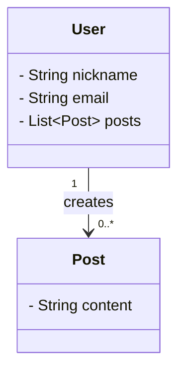

# RESTful API em Java 21

RESTful API em Java API de um domínio de aplicação de uma rede social simples.

Deploy: https://restful-api-java.up.railway.app/swagger-ui.html

## Diagrama de Classes

```mermaid
classDiagram
    class User {
        - String nickname
        - String email
        - List~Post~ posts
    }

    class Post {
        - String content
    }
    
    User "1" --> "0..*" Post : creates
```