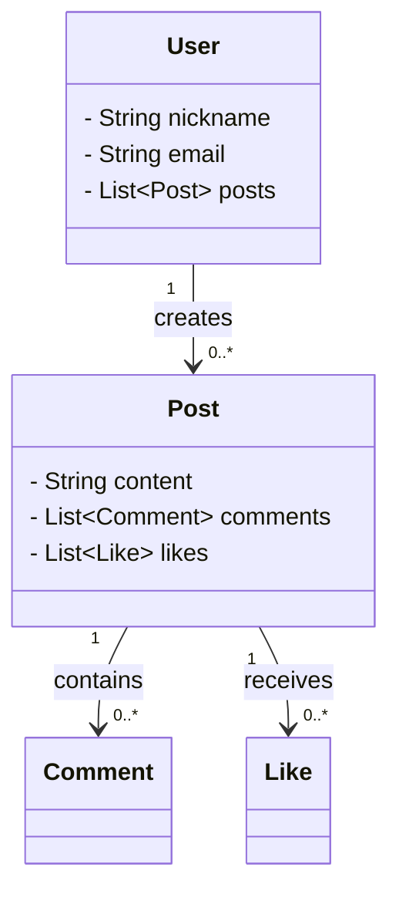

# RESTful API em Java 21

RESTful API em Java API de um domínio de aplicação de uma rede social simples.

## Diagrama de Classes

```mermaid
classDiagram
    class User {
        - String nickname
        - String email
        - List~Post~ posts
    }

    class Post {
        - String content
        - List~Comment~ comments
        - List~Like~ likes
    }
    
    User "1" --> "0..*" Post : creates
    Post "1" --> "0..*" Comment : contains
    Post "1" --> "0..*" Like : receives
```